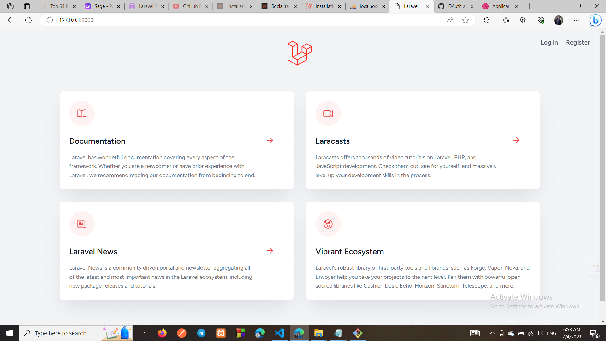
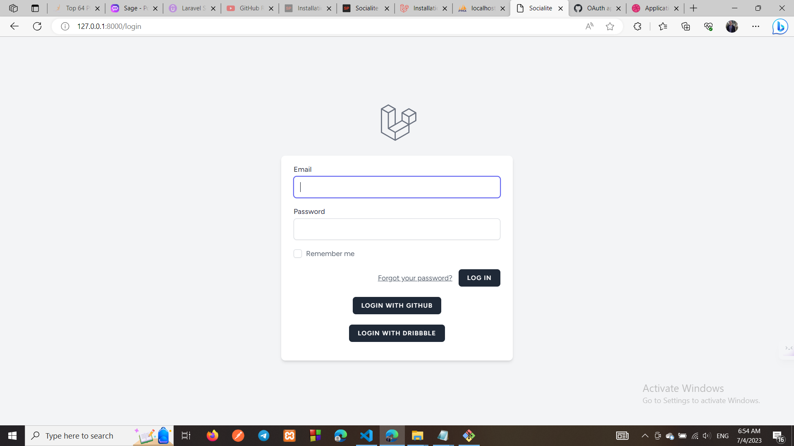
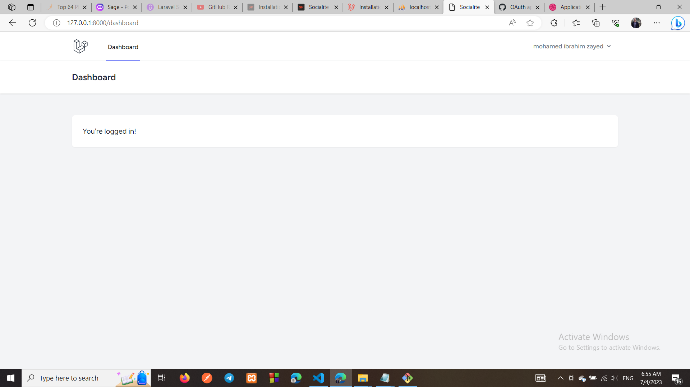

## Laravel Socialite using Githhub and Dribbble







**Created By :** Mohamed Ibrahim Zayed
**Email :** mohamedzayed52100@gmail.com

This is the main readme file for the project used in laravel socialite 

## Installation

To get started, clone this repository.

```
git clone https://github.com/Mohamedzayed52100/socialite.git
 
```


Next, copy your `.env.example` file as `.env` and configure your Database connection.

```
DB_CONNECTION=mysql
DB_HOST=127.0.0.1
DB_PORT=3306
DB_DATABASE=YOUR-DATABASE-NAME
DB_USERNAME=YOUR-DATABASE-USERNAME
DB_PASSWORD=YOUR-DATABASE-PASSWROD
```

## Run Packages and helpers

You have to all used packages and load helpers as below.

```
composer install
npm install
npm run dev
npm run build
```

## Generate new application key

You have to generate new application key as below.

```
php artisan key:generate
```

## Run Migrations and Seeders

You have to run all the migration files included with the project and also run seeders as below.

```
php artisan migrate
php artisan db:seed
```
